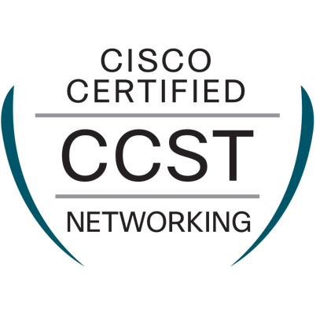

<h1 align="center">Olá 👋, eu sou Luis Henrique Mistura da Silva</h1>

<h3 align="center">
  Analista de Redes Júnior | Certificado CCST | Certificado AZ-900 | Em evolução para me tornar Engenheiro de Redes
</h3>

<p align="center">
  
</p>

<p align="center">
  <a href="https://www.linkedin.com/in/luis-henrique-mistura-da-silva-35a9051b2">
    
  </a>
</p>

---

<h2>👨‍💻 Sobre Mim</h2>

<p>
Atuo como <strong>Analista de Redes Júnior</strong>, construindo minha carreira nas áreas de redes de computadores e infraestrutura.
</p>

<p>
Ao longo da minha trajetória profissional, também atuei como <strong>Analista de Suporte Técnico de Infraestrutura</strong> e <strong>Assistente de TI</strong>, experiências que contribuíram para a construção de uma base sólida em suporte técnico, infraestrutura e troubleshooting de redes.
</p>

<p>
Meu objetivo profissional é evoluir continuamente até me tornar um <strong>Engenheiro de Redes</strong>, aprofundando meus conhecimentos em redes corporativas e tecnologias de infraestrutura.
</p>

<p>
Atualmente, estou aprofundando meus conhecimentos em redes com foco no conteúdo do <strong>CCNA</strong> e iniciando meus estudos em <strong>Python aplicado à automação de redes</strong>.
</p>

---

<h2>🛠️ Skills</h2>

<h3>🌐 Redes</h3>

<p>
  
</p>

<p>
Conhecimentos em tecnologias Cisco e redes de computadores, com experiência prática e evolução contínua no ecossistema Cisco.
</p>

<h3>📚 Em desenvolvimento</h3>

<p>
  
  &nbsp;&nbsp;
  
  &nbsp;&nbsp;
  
</p>

<p>
Python, Linux e Visual Studio Code fazem parte das tecnologias que estou desenvolvendo atualmente, com foco futuro em automação e infraestrutura de redes.
</p>

---

<h2>🏅 Certificações</h2>

<p>
  <a href="https://www.credly.com/badges/8cb43f65-4c43-4a38-b90f-f468eb487316/public_url">
    
  </a>
  &nbsp;&nbsp;&nbsp;&nbsp;
  <a href="https://learn.microsoft.com/api/credentials/share/pt-br/LusHenriqueMisturadaSilva-6190/4566350C2CE5EA24?sharingId=2F252E577BAB2CA2">
    
  </a>
</p>

<p>
  <strong>CCST Networking</strong> &nbsp;&nbsp; | &nbsp;&nbsp;
  <strong>Microsoft Azure Fundamentals (AZ-900)</strong>
</p>

---
<h2>💼 Experiência Profissional</h2>

<h3>🌐 Analista de Redes Júnior</h3>

<p>
<strong>Cargo atual</strong>
</p>

<ul>
  <li>Atuação com infraestrutura de redes e conectividade.</li>
  <li>Desenvolvimento de conhecimentos práticos em roteamento, switching e troubleshooting de redes.</li>
  <li>Aprimoramento contínuo em redes com foco em tecnologias Cisco.</li>
  <li>Construção de uma base técnica para futuros projetos de automação de redes.</li>
</ul>

---

<h2>🎯 Objetivos Profissionais</h2>

<ul>
  <li>Aprofundar meus conhecimentos em redes corporativas.</li>
  <li>Consolidar os conhecimentos relacionados ao CCNA e continuar evoluindo no ecossistema Cisco.</li>
  <li>Desenvolver conhecimentos em Python voltados para automação de redes.</li>
  <li>Construir laboratórios práticos de redes e documentá-los no GitHub.</li>
  <li>Evoluir profissionalmente para atuar como Engenheiro de Redes especializado em redes e automação.</li>
</ul>

```
